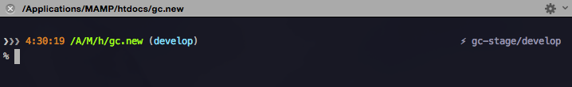
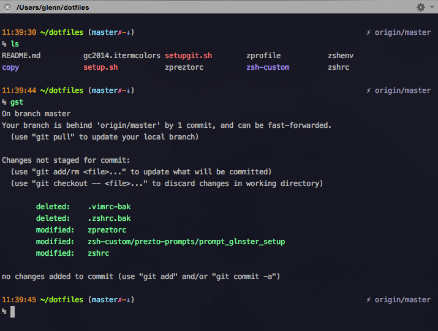

dotfiles
========

Config files for zsh + Prezto, a git-info prompt, bash, git, vim, and iTerm.

## Install
Install zsh+Prezto if you like, clone this repo and run setup.sh (which also calls setupgit.sh).

***Please review setup.sh to see what it does. It may overwrite your current configs.***

### zsh, Prezto, vim
I haven't gotten around to testing an install from scratch. For now you'd have to install zsh, Prezto, possibly Vim+submodules, t (trash), etc. manually.

After installing zsh & Prezto, replace the default symlinks it made, with new ones, pointing them instead to the z* files in dotfiles. (setup.sh does this for you).

E.g. In your ~ directory, do...
```% ln -sf dotfiles/shell/zpreztorc .zpreztorc```

### other apps
- t - Cross-platform command-line app for moving files and directories to the trash - A safer alternative to `rm` https://github.com/sindresorhus/trash
- pygmentize - syntax highlighter I use to colorize `cat`, `alias`. http://pygments.org/.
To install...
	```% easy_install Pygments```

- gvm, nvm, jenv, rvm

### running setup.sh

- It makes symlinks of .files hard-coded in the script
- Makes backups of any .extra/.gitconfig it may find in $HOME
- Copies a template .gitconfig & .extra to $HOME in their place (prompts for overwriting)
- Finally, it runs setupgit.sh

### setupgit.sh
- loads the .gitconfig template
- prompts for your full Git name, email, and push default
- does a ```git config --global --replace-all``` using your input, which updates your new, local .gitconfig

## glnster Prezto prompt
#### A theme based on steeef theme that features:
- Remote Git branch on the right
- Time-stamp & local Git branch info on the left
- Path is abbreviated. Full path shown on terminal title/tab bar (iTerm2)
- Dual line prompt


#### Git info indicators
- Clean - just a blue branch name without any symbols
- Dirty/modified - ✗
- Added/deleted files - +, -
- Ahead/behind - ↑, ↓
- Anything stashed - ✭
- Anything untracked - ~



## Local files
Local/customized files that should stay local/private...

- ~/.extra
- ~/.gitconfig (git author, email, push setting)
- ~/.vim.local
- ~/.vim.bundles.local

## TODO
- test install from scratch
- brew/cask to install zsh, prezto, apps
- bring in sublime text prefs

## Credits
**Huge thanks** to the following people for their dotfile/coding inspiration.

- [https://github.com/mathiasbynens](https://github.com/mathiasbynens)
- [https://github.com/paulirish/dotfiles](https://github.com/paulirish/dotfiles)
- [https://github.com/cowboy/dotfiles](https://github.com/cowboy/dotfiles)
- [https://github.com/kevinSuttle/dotfiles](https://github.com/kevinSuttle/dotfiles)
- [Veraticus / prompt_josh_setup.zsh](https://gist.github.com/Veraticus/1b30a6b6cbe8dae57e9f)
- [https://github.com/jondavidjohn](https://github.com/jondavidjohn)
